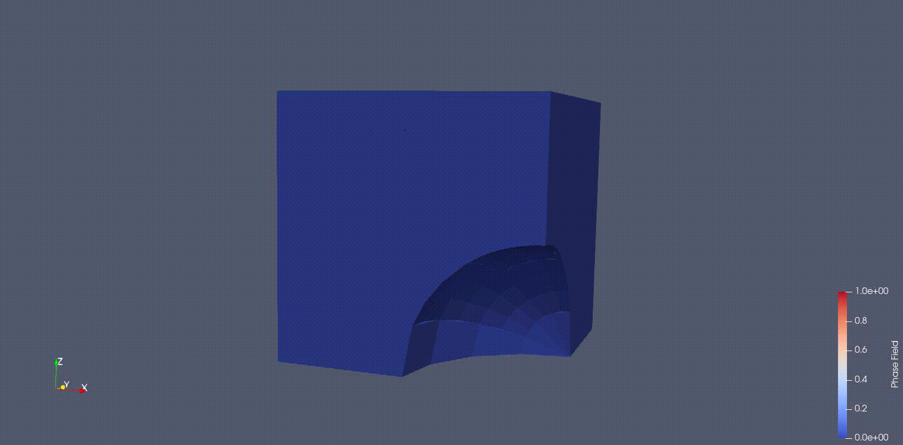
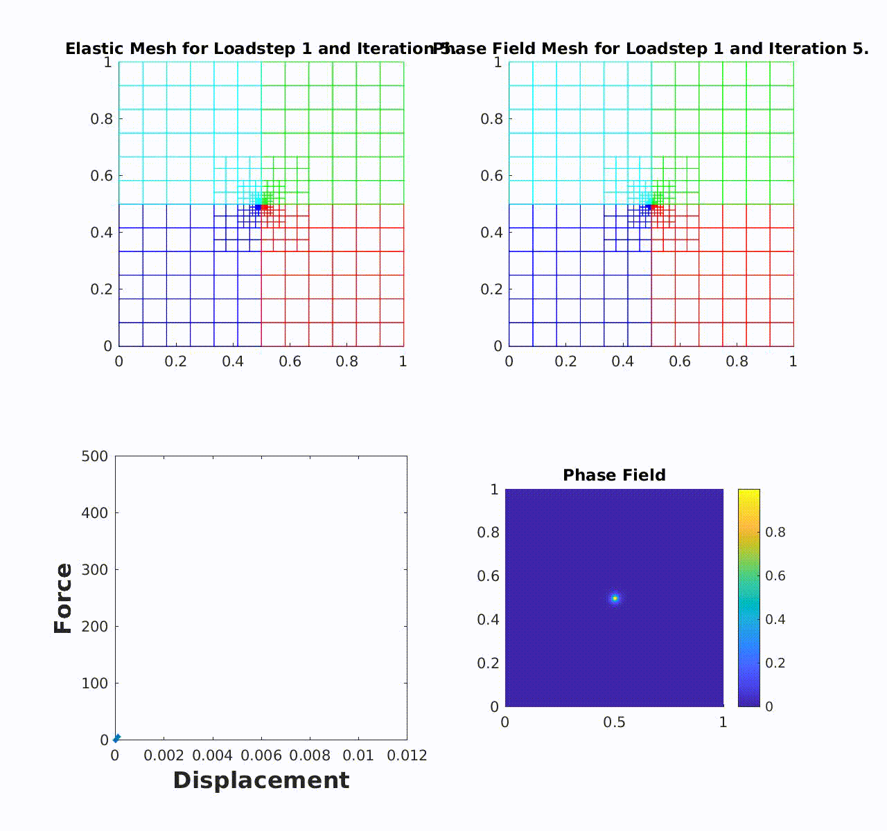

## Fracture modeling using Physics Informed Neural network

 [Source](https://github.com/somdattagoswami/DEM-PhaseField)

The Physics informed neural networks (PINNs) are trained to solve supervised learning problems while respecting any given law of physics described by general non-linear partial differential equations. While most of the PINN approaches available in the literature minimize the residual of the governing PDEs, the proposed PINN approach takes a different path by minimizing the variational energy of the system to resolve the crack path using the phase field modeling approach. One major advantage of the variational energy formulation resides in the fact that it requires derivatives one order lower than in the conventional residual minimization approach. Hence, this approach is computationally efficient. The concept of **transfer learning** and **adaptive refinement technique** has been developed and integrated with the developed PINNs approach.

Companion paper:  
  1. [Adaptive fourth-order phase field analysis using deep energy minimization](https://doi.org/10.1016/j.tafmec.2020.102527)
  1. [An energy approach to the solution of partial differential equations in computational mechanics via machine learning:Concepts, implementation and applications](https://doi.org/10.1016/j.cma.2019.112790)
  1. [Transfer learning enhanced physics informed neural network for phase-field modeling of fracture](https://doi.org/10.1016/j.tafmec.2019.102447)

## Adaptive phase field modeling of fracture using Isogeometric analysis
 [Source](https://github.com/somdattagoswami/IGAPack-PhaseField)

- Phase field modeling of fracture is a popular approach in the category of continuous fracture modeling approach. This approach aims to simultaneously solve for the displacement field and fracture region by energy minimization and no assumption for the evolution of the cracks is needed, thereby generalizing the Griffith's theory for brittle fracture.  
- While the phase field approach has numerous advantages, the practical application is severely limited due to the computational cost. In order to ensure a numerically stable crack propagation, the size of the elements must be sufficiently small to adequately resolve the damage region.
- Fracture analysis exhibits varying material properties in a local zone. Uniform refinement of the domain requires a significant computational effort when trying to capture quantities of local interest. To make the computational model efficient, we propose an adaptive mesh refinement approach, where we design a refinement scheme to refine the mesh locally and adaptively, for an accurate and efficient solution. 
- The solution scheme for both the second and the fourth-order phase field model is implemented using PHT-splines within the framework of Isogeometric analysis. Both cubic and quadratic stress degradation functions have been used.

Companion paper: [Adaptive fourth-order phase field analysis for brittle fracture](https://www.sciencedirect.com/science/article/pii/S0045782519307005)

## Dual mesh approach of fracture modeling using Isogeometric analysis
 [Source](https://github.com/somdattagoswami/IGAPack-DualMeshPhaseField)

- PHT splines are C0 continuous at patch boundaries. Hence, thesis are not suitable for fourth-order phase field modeling with multiple patch geometries. 
- The second-order phase field model requires C0 smooth basis functions over the whole domain. Consequently, a dual-mesh approach for the second-order phase field model is devised, that allows to relax the stringent mesh refinement criteria. 
- The dual-mesh uses a coarser discretization for the displacement field and a finer discretization for the phase field. The smaller element size in the phase field mesh ensures a numerically stable crack growth, while larger elements in the elastic mesh reduce the computational cost significantly. 
- Also, independent refinement strategies for both the fields are employed. A recovery-based *a posteriori* error estimator drives the adaptive refinement on the elastic mesh, while a critical threshold value of the phase field parameter determines the need for refinement on the phase field mesh.

Companion paper: [Adaptive phase field analysis with dual hierarchical meshes for brittle fracture](https://www.sciencedirect.com/science/article/abs/pii/S0013794419302814)

